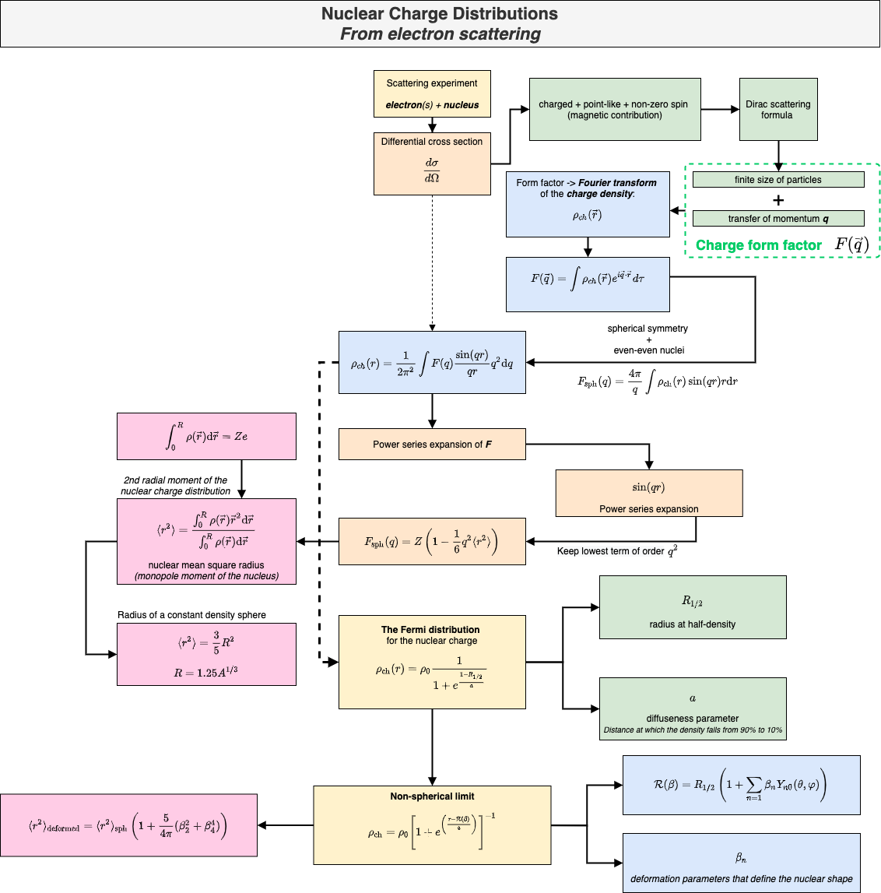

# Workflow Diagrams

> View physical concepts in a clear & concise structure

A collection of diagrams mainly related to Physics topics, such as Nuclear Structure, Quantum Mechanics, and others. Each subject will be structured in a convenient  way, with only the essential information that is needed in order to get a *good grasp* on the topic at hand,

* The repository is organized in folders containing the actual diagrams (named accordingly to their subject). 🗂
* Any diagram will contain a final figure (e.g., a `.pdf` or `.png` file) and the original source file. 📄
* Some diagrams with concepts from Computer Science are also available. 💻
* Content will be continously extended. ⚙️ 

## Development

The diagrams will be mostly created in [diagrams.net](https://www.diagrams.net/). This is a free browser interface which allows creation of complex diagrams and also export to different file formats.

## Example with a diagram

🗓 Below a diagram showing information with regards to the *nuclear charge distribution* is shown. The development was done within [diagrams.net](diagrams.net).

